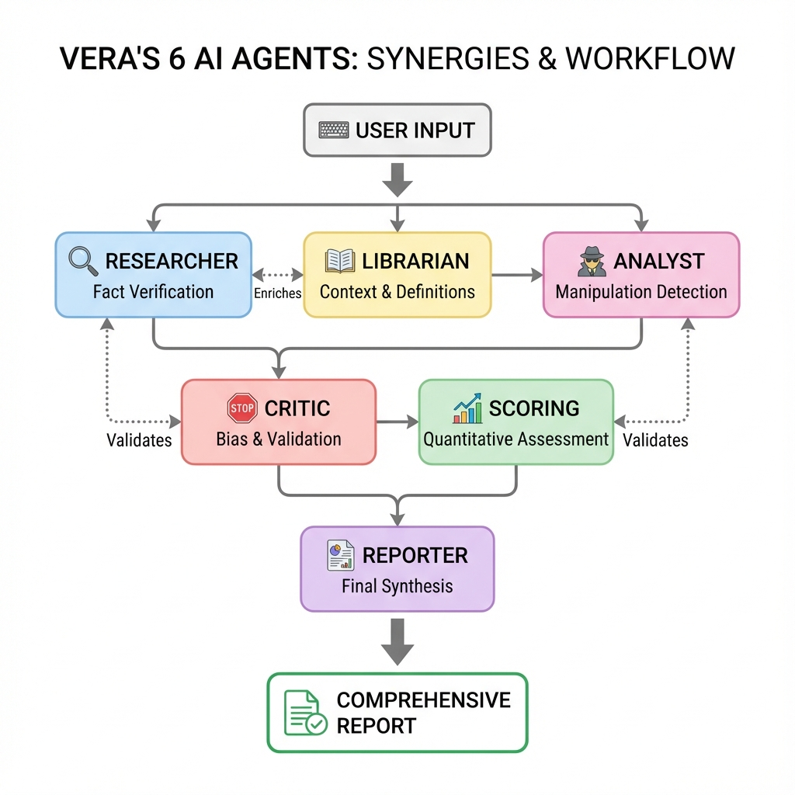
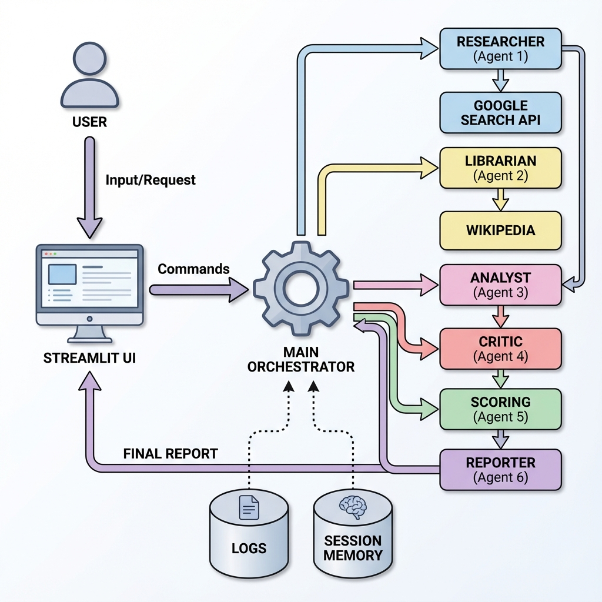
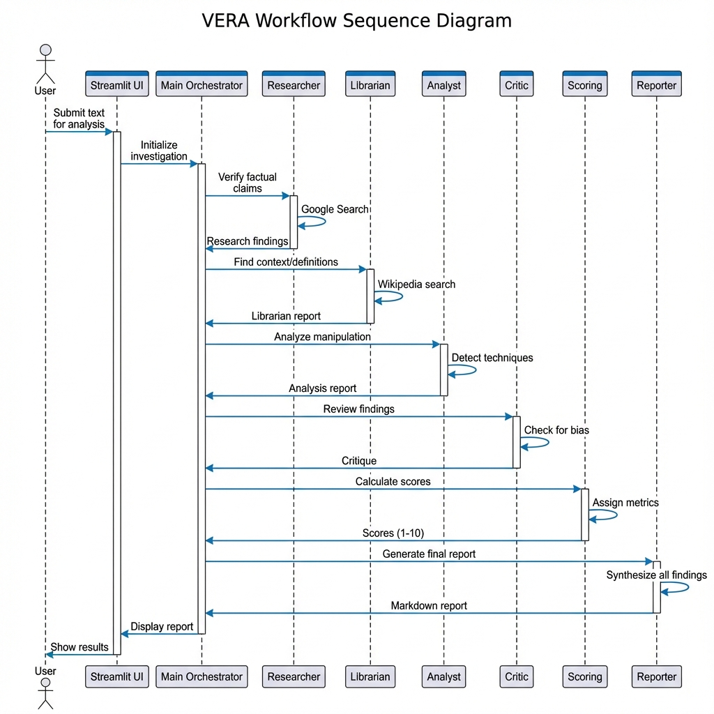
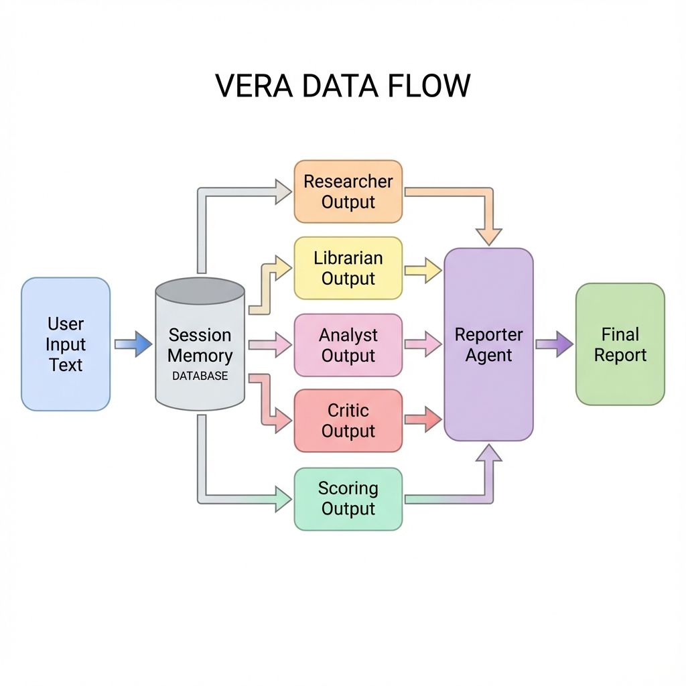

# VERA - Virtual Evidence & Reality Assessment

[](https://creativecommons.org/licenses/by-sa/4.0/)
[](https://www.python.org/downloads/)
[](https://github.com/google/adk)
[](https://streamlit.io)

> **Capstone Project** for Google's Agents Development Kit (ADK) Course  
> An advanced multi-agent system for detecting disinformation and manipulation in text using Google's Gemini AI.

---

## ⚠️ IMPORTANT DISCLAIMER

**VERA is a research prototype and educational tool. It is NOT a substitute for professional fact-checking or critical thinking.**

### Limitations and Warnings

> **🚨 NO WARRANTY**: This software is provided "AS IS" without warranty of any kind, express or implied. The authors and contributors make NO guarantees about accuracy, reliability, or fitness for any particular purpose.

**Critical Limitations:**
- ❌ **AI Hallucinations**: VERA uses LLMs which can generate false information ("hallucinate")
- ❌ **Not Authoritative**: Results should NOT be treated as definitive truth
- ❌ **Requires Verification**: Always verify important claims through multiple independent sources
- ❌ **No Legal Decisions**: Do NOT use VERA outputs as sole basis for legal, financial, medical, or other critical decisions
- ❌ **Bias Risk**: AI models may reflect biases present in training data
- ❌ **Time-Sensitive**: Information may become outdated; always check publication dates

### Recommended Use

✅ **Educational purposes** - Learning about AI and fact-checking  
✅ **Initial screening** - First-pass analysis before deeper research  
✅ **Research tool** - Part of a broader fact-checking methodology  
✅ **Awareness building** - Understanding manipulation techniques  

❌ **NOT for**: Legal evidence, medical advice, financial decisions, or any high-stakes determinations

### Liability Disclaimer

**BY USING THIS SOFTWARE, YOU ACKNOWLEDGE:**
1. VERA is an experimental AI system with inherent limitations
2. You will NOT rely solely on VERA's outputs for important decisions
3. You will verify all critical information through authoritative sources
4. The authors bear NO responsibility for decisions made based on VERA's analysis
5. You use this software entirely at your own risk

**For professional fact-checking, consult:**
- Established fact-checking organizations (Snopes, PolitiFact, FactCheck.org)
- Subject matter experts
- Primary sources and official documentation
- Multiple independent verification sources

---

## 📋 Table of Contents

- [Problem Statement](#-problem-statement)
- [Solution](#-solution)
- [Architecture](#-architecture)
- [Key Features](#-key-features)
- [Technology Stack](#-technology-stack)
- [Quick Start](#-quick-start)
- [Detailed Setup](#-detailed-setup)
- [Usage](#-usage)
- [Deployment](#-deployment)
- [Project Structure](#-project-structure)
- [Competition Requirements](#-competition-requirements)
- [Contributing](#-contributing)
- [License](#-license)

---

## 🎯 Problem Statement

In today's digital age, **disinformation and manipulative content** spread rapidly across social media, news platforms, and messaging apps. Manual fact-checking is:

- ⏱️ **Time-consuming** - Hours to verify a single article
- 🔍 **Incomplete** - Human reviewers miss subtle manipulation techniques
- 📊 **Subjective** - Inconsistent evaluation criteria
- 🌍 **Not scalable** - Cannot keep pace with content volume

### Real-World Impact

- **Political manipulation** during elections
- **Health misinformation** (e.g., COVID-19, vaccines)
- **Financial scams** and investment fraud
- **Social polarization** through targeted propaganda

---

## 💡 Solution

**VERA** (Virtual Evidence & Reality Assessment) is an **AI-powered multi-agent system** that automatically analyzes text for disinformation and manipulation using:

1. **URL Content Extraction** - Automatically fetches and analyzes web articles
2. **Factual Verification** - Cross-references claims with Google Search and Wikipedia
3. **Manipulation Detection** - Identifies propaganda techniques and logical fallacies
4. **Critical Review** - Evaluates bias and methodological flaws
5. **Quantitative Scoring** - Provides objective metrics (1-10 scale)
6. **Comprehensive Reporting** - Generates structured markdown reports

### Agent Roles & Tools

Each agent specializes in a specific aspect of analysis:

#### 🔍 **Researcher Agent**
**Role:** Fact-checking and verification  
**Tools:** 
- `google_search` (Google Grounding API) - Searches the web for factual information
**Output:** Research findings with source citations and claim verdicts

#### 📚 **Librarian Agent**
**Role:** Contextual information and definitions  
**Tools:**
- `search_wikipedia` (Custom tool) - Searches Wikipedia for background context
**Output:** Definitions, historical context, and encyclopedic information

#### 🧐 **Analyst Agent**
**Role:** Manipulation and propaganda detection  
**Tools:** None (pure LLM analysis)  
**Output:** Identified manipulation techniques, emotional appeals, and logical fallacies

#### 🛑 **Critic Agent**
**Role:** Quality review and bias detection  
**Tools:** None (pure LLM analysis)  
**Output:** Critique of previous findings, identification of potential biases

#### 📊 **Scoring Agent**
**Role:** Quantitative assessment  
**Tools:** None (pure LLM analysis)  
**Output:** Three scores (1-10):
- Disinformation Level
- Manipulation Level
- Analysis Confidence

#### 📝 **Reporter Agent**
**Role:** Final report synthesis  
**Tools:** None (pure LLM analysis)  
**Output:** Structured markdown report combining all findings

### Sequential Workflow

```
User Input (Text or URL)
    ↓
[URL Detection & Extraction] ← BeautifulSoup web scraper
    ↓
Researcher Agent → Google Search → Fact-check claims
    ↓
Librarian Agent → Wikipedia → Provide context
    ↓
Analyst Agent → Detect manipulation techniques
    ↓
Critic Agent → Review for bias
    ↓
Scoring Agent → Calculate metrics
    ↓
Reporter Agent → Generate final report
    ↓
Markdown Report (displayed to user)
```

### Why VERA vs. Manual Fact-Checking?

| Feature | Manual Review | VERA |
|---------|--------------|------|
| **Time** | 4-6 hours per article | 2-3 minutes |
| **Coverage** | Limited sources (2-3) | Multiple sources (Google + Wikipedia) |
| **Analysis Depth** | Single perspective | 6 specialized perspectives |
| **Consistency** | Subjective, varies by reviewer | Objective scores (1-10 scale) |
| **Scalability** | 1-2 articles per day | Unlimited articles |
| **Cost** | High (expert labor: $50-100/hour) | Low (API costs: ~$0.01-0.05/analysis) |
| **Bias Detection** | Depends on reviewer expertise | Dedicated Critic Agent |
| **Audit Trail** | Manual notes | Full report with source citations |

### Real-World Use Case

**Scenario:** Viral Social Media Post During Election Campaign

> *"Breaking: Leaked documents prove candidate X received illegal foreign funding. Mainstream media is covering it up!"*

**Without VERA:**
- ⏱️ Manual verification: 4-6 hours
- 🔍 Limited source checking (2-3 news sites)
- 🤔 May miss subtle manipulation techniques
- 📊 Subjective assessment
- ❌ No standardized scoring

**With VERA:**
1. **Input:** Paste text or URL (30 seconds)
2. **Analysis:** Automatic multi-agent investigation (2-3 minutes)
   - 🔍 Researcher: Fact-checks claims via Google Search
   - 📚 Librarian: Provides context via Wikipedia
   - 🧐 Analyst: Identifies manipulation techniques (emotional appeals, conspiracy framing)
   - 🛑 Critic: Reviews for bias and logical fallacies
   - 📊 Scoring: Disinformation Level: 8/10, Manipulation Level: 9/10
3. **Output:** Comprehensive markdown report with:
   - ✅ Verified facts with sources
   - ⚠️ Identified manipulation techniques
   - 📊 Objective scores
   - 📝 Executive summary

**Result:** Decision-makers can quickly assess credibility and take informed action.

### Why Multi-Agent Architecture?

**Single LLM Approach (Traditional):**
- ❌ One model tries to do everything
- ❌ Generic analysis, lacks specialization
- ❌ No cross-validation of findings
- ❌ Limited tool usage (one model, one tool set)
- ❌ Prone to hallucinations without fact-checking

**VERA's Multi-Agent Approach:**

**1. Specialization** - Each agent masters one aspect
- 🔍 **Researcher** → Fact-checking expert with Google Search
- 📚 **Librarian** → Context specialist with Wikipedia
- 🧐 **Analyst** → Manipulation detection expert
- 🛑 **Critic** → Bias detection and validation expert
- 📊 **Scoring** → Quantitative assessment specialist
- 📝 **Reporter** → Synthesis and communication expert

**2. Cross-Validation** - Agents review each other's work
- Critic validates Researcher's fact-checking
- Critic challenges Analyst's manipulation findings
- Scoring synthesizes all perspectives for objectivity
- Reporter ensures consistency across all findings

**3. Tool Diversity** - Different agents use different tools
- Researcher → Google Search (real-time, current events)
- Librarian → Wikipedia (historical context, definitions)
- Others → Pure LLM analysis (reasoning, critique)

**4. Emergent Intelligence** - Combined output > sum of parts
- 6 perspectives reveal patterns a single LLM would miss
- Cross-agent validation reduces hallucinations
- Specialized prompts optimize each agent's performance
- Sequential processing builds comprehensive understanding

### Agent Synergy



**Key Synergies:**
- 📚 **Librarian enriches Researcher**: Historical context validates current claims
- 🛑 **Critic validates all**: Independent review catches errors and biases
- 📊 **Scoring synthesizes**: Combines all perspectives into objective metrics
- 📝 **Reporter unifies**: Creates coherent narrative from diverse analyses

---

## 🏗️ Architecture

### System Overview



### Agent Workflow



### Data Flow



---

## ✨ Key Features

### 🌐 URL Content Extraction (BETA)
- **Automatic detection** of URLs in input
- **Web scraping** with BeautifulSoup4
- **Smart content extraction** from articles (supports RIA.ru, BBC, Wikipedia, Gazeta.pl, etc.)
- **Error handling** for timeouts, connection issues, and HTTP errors
- **Content length display** for transparency

> **⚠️ BETA Notice**: URL extraction is a beta feature. It works well with static websites but may have limitations with:
> - JavaScript-heavy sites (content loaded dynamically)
> - Paywalled content (subscription required)
> - Sites with anti-scraping measures
> - Complex page structures
> 
> For best results, use direct text input or try multiple URL sources.

### 🤖 Multi-Agent System
- **6 specialized agents** working in sequence
- **Shared session memory** for context continuity
- **Sequential execution** ensures logical flow
- **Each agent** has a specific role and expertise

### 🔧 Advanced Tools
- **Google Search** (built-in ADK Grounding API) for fact-checking
- **Wikipedia API** (custom tool) for background context
- **Web scraper** (BeautifulSoup4) for URL content extraction
- **Structured logging** with JSON output

### 📊 Observability
- **Real-time UI updates** showing agent progress
- **Comprehensive logging** (JSON + colored console)
- **Performance metrics** (execution time per agent)
- **Session tracking** with unique IDs
- **Per-agent logs** in `logs/agents/` directory

### 🛡️ Security

VERA implements multiple layers of security protection:

#### Prompt Injection Protection
- **Input delimiters**: User content wrapped in `<<<USER_INPUT_START>>>` and `<<<USER_INPUT_END>>>` markers
- **Explicit agent instructions**: Agents instructed to IGNORE any commands within user input
- **Role enforcement**: Agents cannot be redirected from their core responsibilities
- **Attack detection**: Recognizes and blocks common injection patterns ("ignore previous instructions", "you are now", etc.)

#### XSS (Cross-Site Scripting) Prevention
- **Safe markdown rendering**: Reports displayed without `unsafe_allow_html`
- **Automatic HTML escaping**: Streamlit sanitizes all user-generated content
- **No script execution**: Agent outputs cannot inject JavaScript into the UI

#### API Key Security
- **User-provided keys**: No hardcoded credentials in deployment
- **Session-only storage**: API keys stored in browser session memory only
- **No persistence**: Keys never saved to disk or database
- **No logging**: API keys excluded from all log files

#### Input Validation
- **Type checking**: All inputs validated before processing
- **Length limits**: Protection against resource exhaustion
- **Character sanitization**: Special characters handled safely

### 🌍 Multilingual Support
- **Polish** and **English** interface
- **Language-aware** report generation
- **Localized** prompts and instructions

### 📝 Structured Reports
- **Markdown format** for easy reading
- **Quantitative scores** (1-10 scale)
- **Source citations** for transparency
- **Executive summary** for quick overview
- **Detailed sections** for each analysis aspect

---

## 🛠️ Technology Stack

| Component | Technology | Purpose |
|-----------|-----------|---------|
| **AI Framework** | [Google ADK](https://github.com/google/adk) | Multi-agent orchestration |
| **LLM** | Gemini 2.5 Flash | Natural language processing |
| **UI Framework** | [Streamlit](https://streamlit.io) | Web interface |
| **Search** | Google Search API | Fact verification |
| **Knowledge Base** | Wikipedia API | Background context |
| **Logging** | Python logging | Observability |
| **Deployment** | Google Cloud Run | Serverless hosting |
| **CI/CD** | Cloud Build | Automated deployment |

---

## 🚀 Quick Start

### Prerequisites

- Python 3.11+
- Google AI Studio API Key ([Get one here](https://aistudio.google.com/app/apikey))
- Git

### Installation

```bash
# Clone repository
git clone https://github.com/migdaluk/vera.git
cd vera

# Create virtual environment
python3 -m venv .venv
source .venv/bin/activate  # On Windows: .venv\Scripts\activate

# Install dependencies
pip install -r requirements.txt

# Run application
streamlit run vera/main.py
```

**Note:** You'll enter your Google AI Studio API key in the Streamlit sidebar when the app starts.

Open your browser at `http://localhost:8501`

---

## 📖 Detailed Setup

### 1. Environment Setup

```bash
# Create .env file (optional)
cat > .env << EOF
GOOGLE_API_KEY=your-api-key-here
VERA_LANGUAGE=English
EOF
```

### 2. Configuration

Edit `.streamlit/config.toml` for custom settings:

```toml
[server]
port = 8501
address = "localhost"

[theme]
primaryColor = "#1f77b4"
backgroundColor = "#ffffff"
```

### 3. Verify Installation

```bash
# Test imports
python -c "import google.adk; import streamlit; print('✅ All dependencies installed')"

# Check logs directory
ls -la logs/
```

---

## � Usage

### Running VERA

1. **Start the application:**
   ```bash
   streamlit run vera/main.py
   ```

2. **Open browser** at `http://localhost:8501`

3. **Enter API Key** in the sidebar
   - Get your free API key from [Google AI Studio](https://aistudio.google.com/app/apikey)
   - The key is stored only in your browser session (never saved to disk)

4. **Select language** (English or Polski)

5. **Submit text or URL** for analysis

6. **Paste Text or URL** to analyze
   - **Text**: Paste any text content directly (recommended)
   - **URL** (BETA): Paste article URL (e.g., `https://www.bbc.com/news/article-id`)
   - System automatically detects URLs and extracts content
   - **Note**: URL extraction is in BETA - works best with static news sites

5. **Click "Analyze & Verify"**

6. **Review Report** with scores and findings

### Example Inputs

**Text Examples:**
```
"Breaking: Scientists discover cure for aging, pharmaceutical companies hiding the truth!"
```

```
"New study shows coffee causes cancer - mainstream media won't report this!"
```


**Supported URL types:**
- ✅ News articles
- ✅ Blogs and static websites
- ⚠️ **BETA limitations**: May not work with JavaScript-heavy sites, paywalls, or sites blocking scrapers
- 💡 **Tip**: If URL extraction fails, copy the article text manually

### Example Output

```markdown
# VERA Report

## 1. Quantitative Assessment
- **Disinformation Level**: 9/10
- **Manipulation Level**: 8/10
- **Analysis Confidence**: 9/10

## 2. Executive Summary
The text contains multiple red flags including unverified health claims,
appeal to authority fallacy, and conspiracy theory framing...

## 3. Factual Verification - Key Claims
- Claim: "10 cups of coffee cures all diseases"
  - Verdict: FALSE
  - Sources: [Medical journals, WHO guidelines]
...
```

### Advanced Usage

#### Custom Prompts

Modify agent instructions in `vera/agents/`:
- `researcher.py` - Fact-checking behavior
- `analyst.py` - Manipulation detection
- `critic.py` - Bias evaluation

#### Logging

View logs in real-time:
```bash
tail -f logs/vera_*.log
```

Parse JSON logs:
```bash
cat logs/vera_*.log | jq '.message'
```

---

## ☁️ Deployment

### Google Cloud Run (Recommended)

```bash
# Quick deploy
./deploy.sh your-project-id

# Or manual deployment
gcloud builds submit --tag gcr.io/PROJECT_ID/vera-app
gcloud run deploy vera --image gcr.io/PROJECT_ID/vera-app
```

See [DEPLOYMENT.md](docs/DEPLOYMENT.md) for detailed instructions.

### Local Docker

```bash
# Build image
docker build -t vera-app .

# Run container
docker run -p 8080:8080 \
  -e GOOGLE_API_KEY="your-key" \
  vera-app
```

---

## 📁 Project Structure

```
vera/
├── vera/                      # Main application
│   ├── agents/               # Agent definitions
│   │   ├── researcher.py     # Fact-checking agent
│   │   ├── librarian.py      # Wikipedia agent
│   │   ├── analyst.py        # Manipulation detector
│   │   ├── critic.py         # Bias reviewer
│   │   ├── scoring.py        # Metrics calculator
│   │   ├── reporter.py       # Report generator
│   │   └── wikipedia_tool.py # Custom Wikipedia tool
│   ├── utils/                # Utilities
│   │   └── logging_config.py # Logging setup
│   └── main.py               # Streamlit UI
├── logs/                     # Log files
│   ├── agents/              # Per-agent logs
│   └── sessions/            # Per-session logs
├── docs/                     # Documentation
│   └── DEPLOYMENT.md        # Deployment guide
├── .streamlit/              # Streamlit config
│   └── config.toml
├── Dockerfile               # Container definition
├── cloudbuild.yaml          # CI/CD pipeline
├── deploy.sh                # Deployment script
├── requirements.txt         # Python dependencies
└── README.md               # This file
```

---

## 🏆 Competition Requirements

This project demonstrates mastery of **Google ADK** by implementing:

### ✅ 1. Multi-Agent System
- **Sequential agents** - 6 agents in strict order
- **LLM-powered** - All agents use Gemini 2.5 Flash
- **Shared context** - Session memory for continuity

### ✅ 2. Tools
- **Built-in tools** - Google Search (Grounding API)
- **Custom tools** - Wikipedia search function
- **Tool integration** - Proper error handling and logging

### ✅ 3. Sessions & Memory
- **InMemorySessionService** - ADK session management
- **Context engineering** - Prompt injection protection
- **State management** - Unique session IDs per analysis

### ✅ 4. Observability (Bonus)
- **Structured logging** - JSON + colored console
- **Performance metrics** - Execution time tracking
- **UI visualization** - Real-time agent progress

### ✅ 5. Deployment (Bonus)
- **Cloud Run ready** - Dockerfile + deployment scripts
- **CI/CD pipeline** - Cloud Build configuration
- **Production-ready** - Secret management, monitoring

---

## 🚀 Development Journey

### Initial Challenges

**Challenge 1: Tool Conflicts**
- **Problem**: Google Search (Grounding API) and Wikipedia couldn't coexist in one agent due to ADK limitations
- **Solution**: Split into two specialized agents - Researcher (Google Search) and Librarian (Wikipedia)
- **Learning**: Agent specialization improves both functionality and reliability. Sometimes separation is better than integration.

**Challenge 2: Context Sharing Between Agents**
- **Problem**: Agents weren't seeing each other's outputs, leading to disconnected analysis
- **Solution**: Removed individual `output_key` parameters, leveraged shared `InMemorySessionService` for context continuity
- **Learning**: ADK's session management is powerful when used correctly. Shared memory enables true multi-agent collaboration.

**Challenge 3: Sequential vs. Parallel Execution**
- **Problem**: `SequentialAgent` wrapper had tool conflicts and unpredictable behavior
- **Solution**: Implemented manual orchestration with explicit agent sequence in `main.py`
- **Learning**: Sometimes simple is better - manual control provides predictability over complex abstractions.

**Challenge 4: Output Streaming**
- **Problem**: Reporter agent's output wasn't displaying in Streamlit UI
- **Solution**: Check both `event.content` and `event.model_content` for streaming text
- **Learning**: ADK event structure requires careful handling for UI integration.

### Key Design Decisions

**Decision 1: Why 6 Agents?**

Evolution of agent count:
1. **v1**: Started with 3 agents (Researcher, Analyst, Reporter)
2. **v2**: Added Librarian for encyclopedic context (Wikipedia)
3. **v3**: Added Critic for validation and bias detection
4. **v4**: Added Scoring for objective quantitative metrics

**Rationale**: Each agent adds unique, irreplaceable value. Removing any agent would create a gap in analysis quality.

**Decision 2: Why Sequential, Not Parallel?**

- **Tried**: Parallel execution for speed
- **Problem**: Agents need context from previous agents (e.g., Critic needs Researcher's findings)
- **Solution**: Sequential ensures logical flow: Facts → Context → Analysis → Critique → Scoring → Report
- **Result**: More coherent, comprehensive analysis. Speed sacrifice (3 min vs. 1 min) is worth quality gain.

**Decision 3: URL Extraction (BETA)**

- **Why**: User convenience - paste URL instead of copying article text
- **Implementation**: BeautifulSoup4 with smart selectors for common news sites
- **Status**: BETA due to website variability (JavaScript, paywalls, anti-scraping)
- **Learning**: Nice-to-have features should be clearly marked as experimental.

**Decision 4: Observability First**

- **Why**: Multi-agent systems are complex - debugging without logs is impossible
- **Implementation**: Structured JSON logging + colored console + per-agent logs
- **Result**: Essential for development and production monitoring. Competition bonus points!

### Development Iterations

**v1.0** - Proof of Concept
- Single agent with Google Search
- Basic fact-checking only

**v2.0** - Multi-Agent Foundation
- 3 agents: Researcher + Analyst + Reporter
- Sequential workflow established

**v3.0** - Context & Validation
- Added Librarian (Wikipedia) for context
- Added Critic for validation and bias detection
- Shared session memory implemented

**v4.0** - Objectivity & Metrics
- Added Scoring agent for quantitative assessment
- Standardized 1-10 scoring scale

**v5.0** - Observability
- Comprehensive logging system (JSON + colored console)
- Performance metrics and tracing
- Per-agent and per-session logs

**v6.0** - User Experience
- URL extraction (BETA) with BeautifulSoup4
- Streamlit UI improvements (dark mode, workflow visualization)
- Real-time agent progress indicators

**v7.0** - Production Ready
- Docker containerization
- Cloud Run deployment scripts
- CI/CD pipeline with Cloud Build
- Secret management for API keys

### Lessons Learned

1. **Agent Specialization > Generalization**
   - Focused agents with clear roles perform better than one "do-it-all" agent
   - Tool conflicts forced specialization, which improved quality

2. **Cross-Validation Reduces Hallucinations**
   - Critic agent independently validates findings
   - Multiple perspectives catch errors single LLM would miss

3. **Tools Provide Real Grounding**
   - Google Search: Real-time, current information
   - Wikipedia: Historical context and definitions
   - LLM alone is prone to hallucinations without external validation

4. **Observability is Essential**
   - Logging helped debug complex multi-agent interactions
   - Performance metrics revealed bottlenecks (Researcher takes longest)
   - Session tracking enables reproducibility

5. **User Experience Matters**
   - URL extraction (even BETA) significantly improves usability
   - Real-time UI feedback keeps users engaged during 2-3 min analysis
   - Dark mode and visual workflow make professional impression

6. **ADK Strengths & Limitations**
   - **Strengths**: Session management, tool integration, Gemini integration
   - **Limitations**: Tool conflicts in single agent, SequentialAgent wrapper issues
   - **Workaround**: Manual orchestration provides full control


---

## 🎓 About This Project

**VERA** was developed as a **Capstone Project** for the [Google Agents Development Kit (ADK) Course](https://developers.google.com/adk).

### Course Context

This project applies concepts learned in the ADK course:
- Multi-agent system design
- Tool integration (built-in and custom)
- Session and memory management
- Production deployment best practices
- Observability and monitoring

### Open Source

VERA is **open source** under the [CC-BY-SA 4.0 License](https://creativecommons.org/licenses/by-sa/4.0/). This project was created for the Google ADK Capstone Competition.

### Author

Created by **Łukasz Migda** as part of Google's ADK Capstone Competition.

📧 Contact: migdaluk@gmail.com
---

## 🤝 Contributing

Contributions are welcome! Please follow these steps:

1. Fork the repository
2. Create a feature branch (`git checkout -b feature/amazing-feature`)
3. Commit your changes (`git commit -m 'Add amazing feature'`)
4. Push to the branch (`git push origin feature/amazing-feature`)
5. Open a Pull Request

### Code Style

- Follow PEP 8 for Python code
- Use meaningful variable and function names
- Add docstrings to functions and classes
- Keep functions focused and single-purpose

---

## 📄 License

This project is licensed under the **CC-BY-SA 4.0 License** - see the [LICENSE](LICENSE) file for details.

[](https://creativecommons.org/licenses/by-sa/4.0/)

---

## 🙏 Acknowledgments

- **Google** for the ADK framework and Gemini API
- **Streamlit** for the excellent UI framework
- **Wikipedia** for the knowledge base API
- **ADK Course Team** for the training and support

---

## 📞 Support

- **Documentation**: [docs/](docs/)


---


---

<div align="center">

**Made with ❤️ using Google ADK**

</div>
