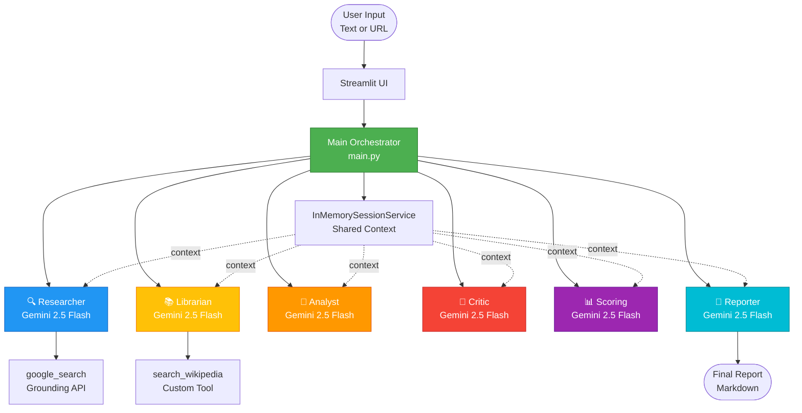
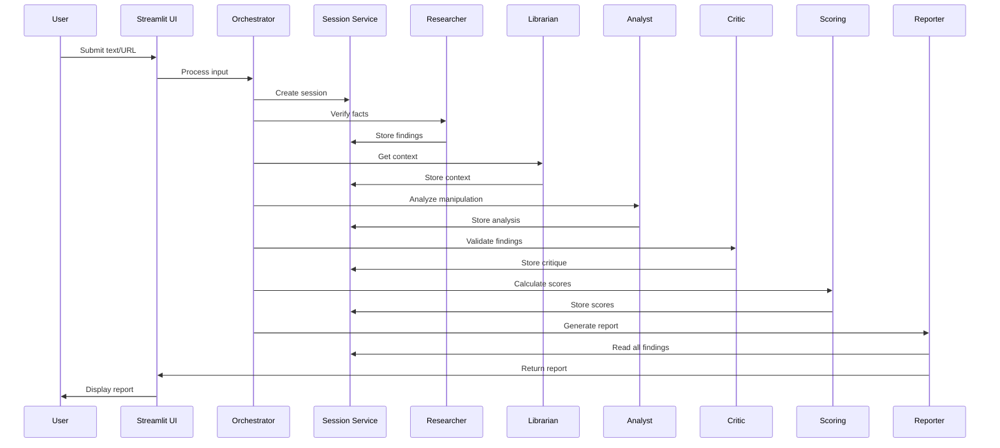

# VERA - System Architecture

## Overview

**VERA** (Virtual Evidence & Reality Assessment) is a multi-agent system designed to detect disinformation and manipulation in text using specialized AI agents powered by Google's Gemini 2.5 Flash.

## System Architecture

### High-Level Design



## Agent Responsibilities

### 🔍 Researcher Agent
**File:** `vera/agents/researcher.py`  
**Model:** `gemini-2.5-flash`  
**Tools:** `google_search` (Google Grounding API)

**Responsibilities:**
- Identifies key factual claims in the text
- Searches for reliable sources using Google Search
- Compares claims with evidence found
- Provides research findings with source citations

**Output:** Fact-checking report with verdicts and sources

---

### 📚 Librarian Agent
**File:** `vera/agents/librarian.py`  
**Model:** `gemini-2.5-flash`  
**Tools:** `search_wikipedia` (Custom tool)

**Responsibilities:**
- Identifies key terms, concepts, or entities needing context
- Searches Wikipedia for definitions and background information
- Provides encyclopedic context and historical background
- Complements Researcher's real-time news with stable knowledge

**Output:** Context report with Wikipedia summaries

**Design Decision:** Separated from Researcher to avoid tool conflicts between Google Search and Wikipedia in a single agent.

---

### 🧐 Analyst Agent
**File:** `vera/agents/analyst.py`  
**Model:** `gemini-2.5-flash`  
**Tools:** None (pure LLM analysis)

**Responsibilities:**
- Identifies propaganda techniques (bandwagon, fear-mongering, etc.)
- Detects emotional appeals and loaded language
- Analyzes logical fallacies (straw man, false dilemma, ad hominem)
- Assesses manipulation techniques

**Output:** Manipulation analysis report with identified techniques

**Design Decision:** No tools - relies on LLM's reasoning capabilities for pattern recognition.

---

### 🛑 Critic Agent
**File:** `vera/agents/critic.py`  
**Model:** `gemini-2.5-flash`  
**Tools:** None (pure LLM analysis)

**Responsibilities:**
- Reviews Researcher's fact-checking for potential errors or biases
- Challenges Analyst's manipulation findings
- Identifies gaps or inconsistencies in the analysis
- Acts as quality control and "red team"

**Output:** Critique report with constructive feedback

**Design Decision:** Independent validation layer to reduce hallucinations and improve overall quality.

---

### 📊 Scoring Agent
**File:** `vera/agents/scoring.py`  
**Model:** `gemini-2.5-flash`  
**Tools:** None (pure LLM analysis)

**Responsibilities:**
- Synthesizes all previous findings into quantitative scores
- Assigns three metrics on a 1-10 scale:
  - **Disinformation Level** (1=truthful, 10=completely false)
  - **Manipulation Level** (1=neutral, 10=highly manipulative)
  - **Analysis Confidence** (1=uncertain, 10=very confident)
- Provides justification for each score

**Output:** Three scores with justifications

**Design Decision:** Objective scoring provides standardized metrics for decision-making.

---

### 📝 Reporter Agent
**File:** `vera/agents/reporter.py`  
**Model:** `gemini-2.5-flash`  
**Tools:** None (pure LLM analysis)

**Responsibilities:**
- Synthesizes all findings into a comprehensive report
- Creates structured markdown document
- Ensures coherent narrative across all analyses
- Supports multilingual reports (English/Polish)

**Output:** Final VERA analysis report (markdown)

**Design Decision:** Final synthesis layer creates user-friendly output from technical analyses.

---

## Sequential Workflow

VERA uses **manual orchestration** (not SequentialAgent wrapper) for full control:

```
1. User Input (Text or URL)
   ↓
2. URL Extraction (if URL detected)
   ↓
3. Researcher Agent → Fact-checking with Google Search
   ↓
4. Librarian Agent → Context from Wikipedia
   ↓
5. Analyst Agent → Manipulation detection
   ↓
6. Critic Agent → Validation and bias detection
   ↓
7. Scoring Agent → Quantitative assessment
   ↓
8. Reporter Agent → Final report synthesis
   ↓
9. Display Report to User
```

**Key Design Decision:** Sequential execution ensures each agent builds on previous findings, creating emergent intelligence.

---

## Technical Features

### Session Management
- **Service:** `InMemorySessionService`
- **Purpose:** Shared context between agents
- **Benefit:** Each agent sees previous agents' outputs

### Retry Configuration
All agents use exponential backoff:
```python
retry_config = types.HttpRetryOptions(
    attempts=5,
    exp_base=7,
    initial_delay=1,
    http_status_codes=[429, 500, 503, 504],
)
```

### Logging & Observability
- **Structured JSON logs** for production monitoring
- **Colored console logs** for development
- **Per-agent log files** in `logs/agents/`
- **Per-session log files** in `logs/sessions/`

### URL Extraction (BETA)
- **Library:** BeautifulSoup4
- **Purpose:** Automatically extract article content from URLs
- **Status:** BETA - may not work with all websites

---

## Data Flow



---

## Technology Stack

| Component | Technology | Purpose |
|-----------|-----------|---------|
| **LLM** | Gemini 2.5 Flash | All 6 agents |
| **Framework** | Google ADK | Multi-agent orchestration |
| **UI** | Streamlit | Web interface |
| **Search** | Google Grounding API | Real-time fact-checking |
| **Knowledge** | Wikipedia API | Encyclopedic context |
| **Web Scraping** | BeautifulSoup4 | URL content extraction |
| **Logging** | Python logging | Observability |
| **Deployment** | Docker + Cloud Run | Production hosting |

---

## Design Principles

### 1. Specialization over Generalization
Each agent masters one aspect of analysis rather than trying to do everything.

### 2. Cross-Validation
Critic agent independently validates findings to reduce hallucinations.

### 3. Tool Diversity
Different agents use different tools (Google Search, Wikipedia) to provide comprehensive coverage.

### 4. Emergent Intelligence
Sequential processing allows each agent to build on previous findings, creating insights no single agent could produce.

### 5. Observability First
Comprehensive logging enables debugging and production monitoring.

---

## Report Structure

The final report follows this structure:

```markdown
# VERA Analysis Report

## 1. Executive Summary
Brief overview of findings and verdict

## 2. Quantitative Assessment
- Disinformation Level: X/10
- Manipulation Level: X/10
- Analysis Confidence: X/10

## 3. Factual Verification
Key claims with verdicts and sources

## 4. Context & Background
Definitions and encyclopedic information

## 5. Manipulation Analysis
Identified techniques and examples

## 6. Critical Review
Potential biases and limitations

## 7. Conclusion
Final verdict and recommendations
```

---

## Performance Characteristics

- **Analysis Time:** 2-3 minutes per article
- **Cost:** ~$0.01-0.05 per analysis (Gemini API)
- **Throughput:** Unlimited (API-limited only)
- **Accuracy:** Cross-validated by 6 specialized agents

---

## Future Enhancements

1. **Multi-language support** (Spanish, French, German)
2. **Image analysis** (OCR + visual manipulation detection)
3. **API endpoint** for programmatic access
4. **Browser extension** for on-the-fly fact-checking
5. **Integration with fact-checking databases** (Snopes, PolitiFact)

---

*Last updated: 2025-11-29*
